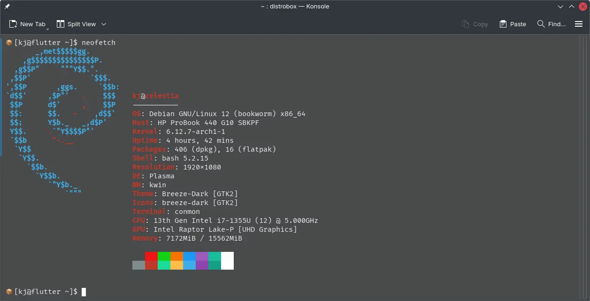

+++

title = "Managing Development Containers"
date = 2024-12-31T18:44:03+05:30

+++

In this blog post, I’ll share how I manage my development containers, why they’re essential for my workflow, and how you can integrate them into yours.

## What Are Development Containers?

Development containers are isolated environments that function like sandboxed operating systems. Essentially, they’re self-contained operating systems that can run independently or with limited interaction with your host operating system (e.g., Windows, Linux, or macOS).


You can think of them as neat little cargo boxes, not interfering with each other.

## Why Do They Matter?

Using development containers opens up a range of possibilities that make development more streamlined, flexible, and efficient. Here are some key benefits:

1. **Platform-Specific Development**: I can run Flutter development in a Debian-based container (since it’s officially supported) while keeping my host environment as Arch Linux.

2. **Version Control**: Containers allow me to work with specific versions of dependencies for a project without affecting or being affected by the versions on my host system.

3. **Environment Consistency**: Sharing the exact development environment with friends or teammates ensures that everyone works with the same setup, reducing “it works on my machine” issues.

## Tools for Managing Development Containers

You have several options for managing development containers. Here are two popular ones:

1. **Distrobox** (based on Podman):
   - Provides tight integration with the host system.
   - Ideal for creating lightweight, flexible environments.

2. **Docker**:
   - A more widely known solution with extensive community support.
   - Excellent for creating highly isolated and reproducible environments.

These tools are your gateways to managing containers effectively.

## How to Create a Debian Distrobox Container

If you want to create a Debian-based Distrobox container for Flutter development, follow these steps:

```bash
distrobox create flutter --image debian
```

After running this command, the required images will be pulled, and necessary packages will be installed. Once complete, you’ll have your Distrobox container ready to use as a development environment. From here, you can export applications, install development tools, and much more.



## Final Thoughts

Development containers are a game-changer for maintaining a clean, flexible, and reproducible workflow. Whether you’re juggling multiple projects, collaborating with a team, or experimenting with new tools, containers help you stay organized and efficient.

## References

- [Dev Containers Tutorial - Visual Studio Code](https://code.visualstudio.com/docs/devcontainers)
- [Official Documentation - Docker](https://docs.docker.com/)
- [Distrobox - GitHub](https://github.com/89luca89/distrobox)