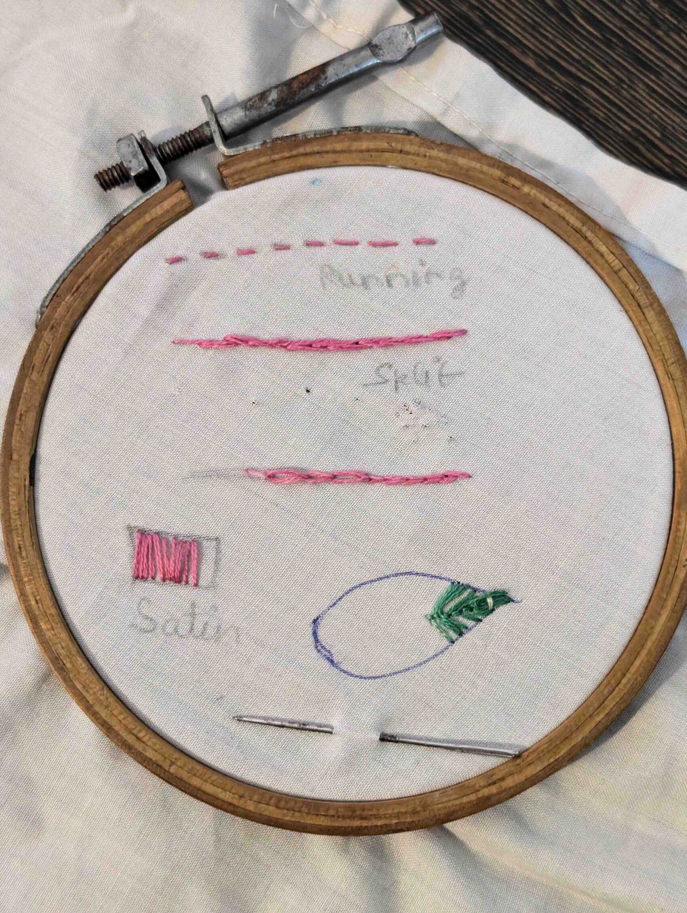

+++
title = 'On Embroidery'
date = 2024-11-21T20:41:06+05:30
+++

Embroidery, if you don’t know already is an art form, relating to the decoration of clothing material with hand woven thread. I saw some reels
about it and it for some reason it uncovered a sense of creativity in me. There is something about personalized clothing that fast-fashion cannot
match.

## Origins

Embroidery in it’s initial forms emerged from the practice of mending clothes. Mending, patch work, tailoring fostered the artistic possibilities
with the thread, which further led to the art of embroidery.

This art form somehow feels very similar to [[Kingsugi]] to me, philosophically speaking. Both art forms explore possibilities with broken or
imperfect things to emerge an idea of beauty from it.

## Aunt Jennifer

The word embroidery somehow always evokes memories of Class 12, reading the poem Aunt Jennifer’s Tigers. I’ll attach it below.
Aunt Jennifer’s tigers prance across a screen, Bright topaz denizens of a world of green. They do not fear the men beneath the tree; They pace
in sleek chivalric certainty.
Aunt Jennifer’s fingers fluttering through her wool Find even the ivory needle hard to pull. The massive weight of Uncle’s wedding band Sits
heavily upon Aunt Jennifer’s hand.
When Aunt is dead, her terrified hands will lie Still ringed with ordeals she was mastered by. The tigers in the panel that she made Will go on
prancing, proud and unafraid.
A beautiful poem.

## My progress

I quickly opened up youtube, and watched the following video.



I was able to complete a few stiches. Once I started to stitch, I realized how broken our patience really is.
Something like embroidery takes time but we're so used to instant gratification that anything that seems to take more than 30 seconds
to provide any gratification seems boring. I resisted the urge and it was worth it.

This is some rusty and old equipment I borrowed from my mom. I know this looks like nothing but it did take time given it was my first time around
trying this out. My plan in the future is to create something on something I actually wear or use. Maybe a hankerchief?

## Closing thoughts

Until next time, how about you try it out?
