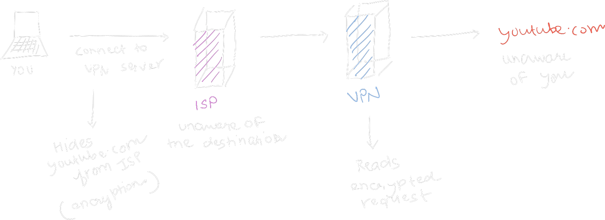

+++
title = 'Virtual Private Networks (VPNs)'
date = 2023-11-14T17:12:44+05:30
tags = ['vpn']
+++

Virtual Private Networks act as an important tool in the modern digital landscape empowering many to protect their privacy, and circumvent government imposed censorship. What the people need is ***choice***. The ability to choose what we wish to share and what we wish to access, and a VPN puts that power in your hands.

Let's talk some tech.

## What is a VPN?

> A virtual private network (VPN) is a mechanism for creating a secure
> connection between a computing device and a computer network, or
> between two networks, using an insecure communication medium such as the
> public Internet
> -- <cite>[Wikipedia][1]</cite>

They provide the ability to ***connect to remote computers, securely***.

> Security and privacy are two distinct concepts.
> <cite> Read more here: [PrivacyGuides][2]</cite>

But why do you care? By connecting to remote computers, you could
***mask and tunnel*** all of your traffic through it. (VPNs are used differently in enterprise)

What do I mean by mask and tunnel?

- Mask
  - The source of all of your traffic now seems to be the VPN server. You forward all the relevant information to the server to make the connections for you. In more simple terms, now you start to pretend to be someone else over the internet, i.e. you start wearing a mask.
- Tunnel
  - A secure tunnel is established between you and the VPN server, via encryption, such that the ISP cannot know what you're trying to access.

### Basic VPN usage:

A VPN shifts your trust from your ISP to a VPN server. Therefore choosing a VPN service is extremely crucial in determing privacy returns. A bad service will just be worse for your privacy.

[1]: https://en.wikipedia.org/wiki/Virtual_private_network
[2]: https://www.privacyguides.org/en/basics/common-threats/#security-and-privacy
[3]: https://chat.openai.com/
