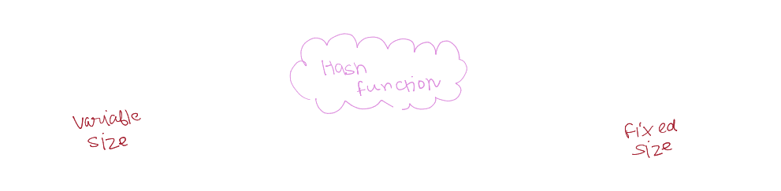
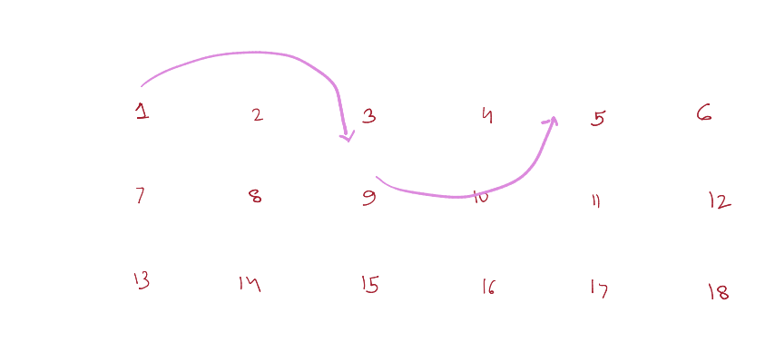
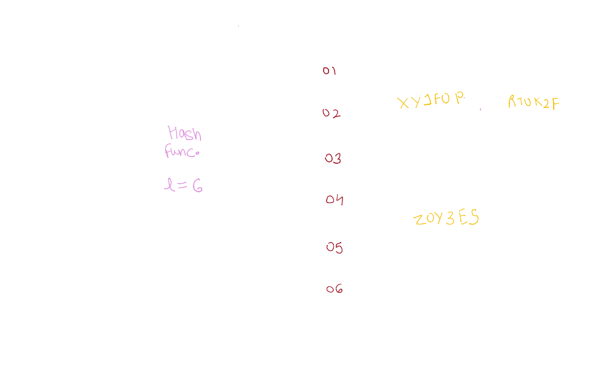

+++
title = 'What Are Hashmaps?'
date = 2024-10-15T15:24:03+05:30
tags = ['hashing', 'linked-list', 'hashmaps']
+++

## Background

Today, we’ll discuss hashmaps—a fundamental data structure in computer science. I chose this topic while solving the "Two Sum" problem, which required the use of hashmaps to efficiently find a solution. In this post, we'll cover hash functions, linked lists, and how they come together to form hashmaps.

## Hashing

Let’s start by understanding hashing. Hashing is a process of mapping variable-sized input data (like strings or numbers) to a fixed-size output. This mapping is carried out by a hashing function.

Hashing functions can produce outputs of different lengths. For example, a hash function that outputs 6 characters will always generate a string of exactly 6 characters.

However, this process creates a challenge. Since there are infinitely many possible inputs but only a finite number of possible outputs, collisions can occur. A collision happens when two different inputs generate the same output. While collisions are inevitable in theory, modern hash functions like SHA256 are designed to minimize their occurrence, making them exceedingly rare in practice.

Hashing is widely used beyond hashmaps. Some common applications include digital signatures, public key cryptography, and more.

## Linked Lists

Now that we understand how hashing works, let’s move on to linked lists, which are crucial in handling collisions in hashmaps.

A linked list is a dynamic data structure that doesn't store elements contiguously in memory. Instead, each element points to the next element, forming a chain-like structure.

## Hashmaps

Hashmaps combine hash functions and linked lists to create a data structure optimized for fast data retrieval. Here's how it works:

First, we use a hashing function to compute the hash of a given key (our input).
This hash is then used to determine the index in an array where the data is stored. We refer to these indices as buckets.
If a collision occurs (i.e., two keys hash to the same bucket), the collided elements are stored as a linked list at that bucket.

By combining the quick lookup capabilities of hash functions with the flexibility of linked lists, hashmaps allow us to efficiently store and retrieve data, even when collisions occur.

# Related

- https://en.wikipedia.org/wiki/Hash_function
- https://crypto.stackexchange.com/questions/47809/why-havent-any-sha-256-collisions-been-found-yet
- https://www.freecodecamp.org/news/how-linked-lists-work/
